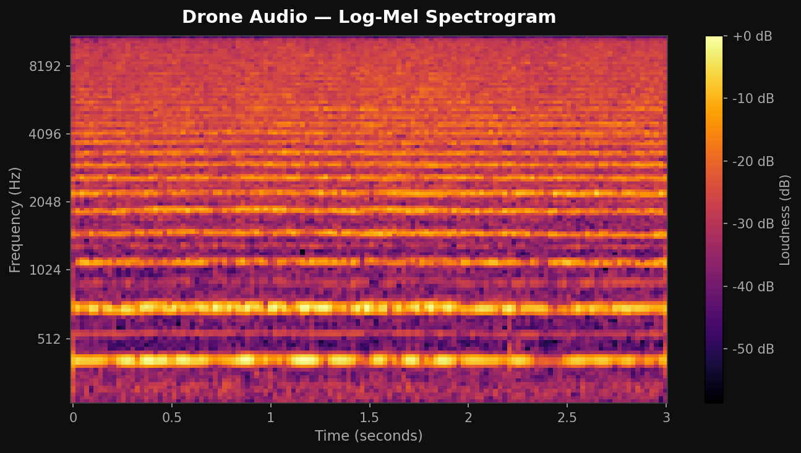
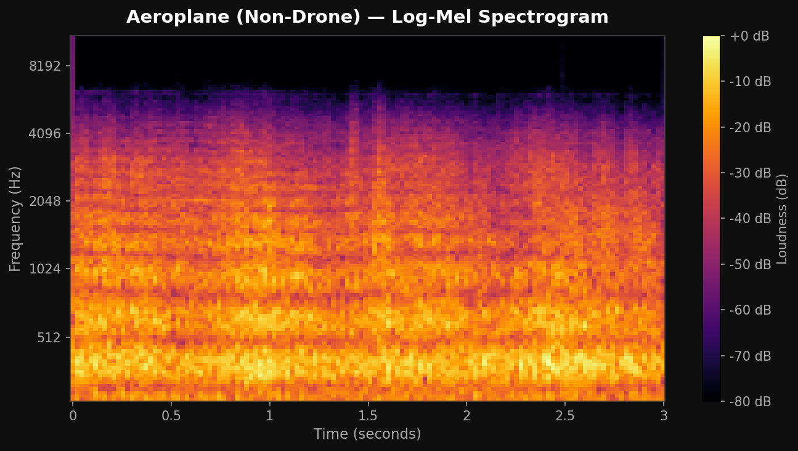

# Drone Detection Audio Classifier

A machine learning system that listens to audio and tells you whether a drone is present or not. Point it at any audio file (a recording from a microphone, a security camera, or even a YouTube clip) and it will say **"DRONE DETECTED"** or **"NO DRONE DETECTED"**, along with a confidence score.

## Demo

<video src="https://github.com/ShikangHu/dronedetection/releases/download/v1.0-demo/demo.mov" controls width="100%"></video>

---

## What does it actually do?

In plain terms: you give it an audio file, and it figures out if a drone is flying nearby. That's it.

Under the hood, it uses a neural network (a type of AI model loosely inspired by how brains work) that was trained to recognise the distinctive hum/buzz of drone motors. It has seen nearly 100,000 audio recordings during training, including both drone sounds and everyday sounds like traffic, street noise, leaf blowers, and aeroplanes, so it knows the difference.

---

## How does it work? (step by step)

**1. Chop the audio into 3-second chunks**

Long audio files are sliced into overlapping 3-second windows (each window overlaps the previous by 1.5 seconds). This way no drone sound gets cut off at the boundary of a chunk.

**2. Turn sound into a picture**

Each 3-second chunk is converted into a **mel spectrogram**, which is essentially a heat map image that shows which sound frequencies are loud or quiet at each moment in time. Lower frequencies are at the bottom, higher ones at the top; brighter colours mean louder. Drone motors produce a very specific pattern on this image.

> **What's a mel spectrogram?** It's a way of visualising sound. Instead of storing the raw audio wave, you take a snapshot of what frequencies are present at every fraction of a second and lay them out as an image. "Mel" means the frequency axis is scaled to match how human ears perceive pitch.



*Drone audio. The bright horizontal bands stacked evenly on top of each other are harmonics: the same motor frequency repeating at 2×, 3×, 4× and so on. This "ladder" pattern runs steadily across the entire 3 seconds and is the key visual signature the model learns to detect.*



*Aeroplane (non-drone) audio. Energy is smeared broadly across all frequencies with no repeating structure, just a continuous gradient blob that fades toward the top. There is no harmonic ladder, so the model outputs no detection.*

**3. Run the image through a neural network**

The spectrogram image is fed into **EfficientNet-B0**, an image-recognition model originally designed to classify everyday photos (cats, dogs, cars, etc.). Here it has been fine-tuned to classify one thing: drone or not drone. It outputs a number between 0 and 1, representing the confidence that a drone is present.

> **What's EfficientNet-B0?** It's a convolutional neural network, a type of AI model that's very good at finding patterns in images. "B0" is the smallest and fastest size in the EfficientNet family. It was pre-trained on ImageNet (1.2 million labelled photos) so it already knows how to detect edges and textures; we then re-train just the last layer (and later the whole model) on spectrogram images.

**4. Majority vote**

After scoring every 3-second chunk, the system counts how many were flagged as "drone". If more than half are flagged, the final verdict is **DRONE DETECTED**.

---

## Results

The model was evaluated on a held-out test set it had never seen during training:

| Metric | Score |
|--------|-------|
| Recall | 99.9% |
| Precision | 98.0% |
| F1 Score | 98.9% |
| AUC | 100% |

> **Recall:** out of all actual drone recordings, how many did it catch? Missing a drone is the dangerous failure mode, so this matters most.
>
> **Precision:** out of everything it flagged as drone, how many really were drones? False alarms are annoying but less dangerous.
>
> **F1 Score:** a single number that balances recall and precision.
>
> **AUC:** Area Under the Curve. A measure of how well the model separates drones from non-drones across all possible thresholds. 1.0 is perfect.

For detailed real-world results on recordings outside any dataset, see the section below.

---

## Real-World Inference Results

The following recordings were never part of any training, validation, or test split.

### Individual files

| Recording | True label | Verdict | Segments flagged | Mean confidence |
|-----------|------------|---------|------------------|-----------------|
| Self-recorded drone audio | Drone | Drone detected | 189/190 (99.5%) | 0.971 |
| YouTube drone recording | Drone | Drone detected | 13/15 (86.7%) | 0.792 |
| YouTube aeroplanes | No drone | No drone detected | 0/169 (0%) | ~0.000 |
| YouTube street noise | No drone | No drone detected | 0/1085 (0%) | ~0.000 |
| YouTube traffic | No drone | No drone detected | 0/399 (0%) | ~0.000 |
| Self-recorded leaf blower | No drone | No drone detected | 0/14 (0%) | 0.000 |

6 out of 6 correct. The leaf blower is a notably tricky case because its motor produces a hum similar to a drone; the model correctly rejected it with zero false positives.

### Drone/no-drone dataset

| Class | Correct | Total | Accuracy |
|-------|---------|-------|----------|
| Drone | 3,977 | 4,017 | 99.0% |
| No drone | 14,527 | 15,715 | 92.4% |

---

## Project Structure

```
dronedetection/
│
├── src/dronedetection/       <- The core Python package (the brains)
│   ├── models/               <- Neural network architecture definitions
│   ├── training/             <- Training loop, loss functions, learning rate schedules
│   ├── inference/            <- Code to load a trained model and make predictions
│   ├── evaluation/           <- Metrics computation and error analysis
│   └── utils/                <- Helper functions (config loading, logging, random seeds)
│
├── scripts/                  <- Ready-to-run scripts
│   ├── train.py              <- Train the model from scratch
│   ├── infer_file.py         <- Run the model on a single audio file  <-- start here
│   ├── evaluate.py           <- Evaluate on the test set
│   ├── predict.py            <- Batch predictions on many files
│   ├── export_model.py       <- Export to ONNX (for deployment)
│   └── download_data.py      <- Download the training datasets
│
├── configs/
│   ├── default.yaml          <- All settings: model, training, audio processing
│   └── lightweight.yaml      <- Faster/smaller model config for low-power devices
│
├── tests/                    <- Automated tests to verify the code works correctly
├── model_summary.txt         <- Detailed technical documentation of the trained model
└── pyproject.toml            <- Python package definition and dependencies
```

---

## Getting Started

### Requirements

- Python 3.10 or newer
- A CUDA-capable GPU is recommended for training (CPU works fine for inference on short files)

> **What's CUDA?** CUDA is NVIDIA's platform for running computations on a GPU (graphics card). GPUs are much faster than CPUs for training neural networks because they can do thousands of calculations at once. If you don't have an NVIDIA GPU, the code will automatically fall back to the CPU, though it will just be slower.

### Installation

```bash
# Clone the repo
git clone https://github.com/ShikangHu/dronedetection.git
cd dronedetection

# Install the package and all dependencies
pip install -e .
```

> The `-e` flag installs in "editable" mode, meaning changes you make to the source code take effect immediately without reinstalling.

---

## Running Inference (Testing a File)

This is the most useful thing you can do right away. Point the script at any `.wav` audio file:

```bash
python scripts/infer_file.py --audio /path/to/your/audio.wav
```

Example output:

```
File: recording.wav
  Duration:    45.00s
  Sample rate: 44100 Hz

Segmenting: 29 segments (3s each, 50% overlap)
Threshold: 0.5

------------------------------------------------------------
RESULTS: 28/29 segments classified as DRONE (96.6%)
  Mean confidence:   0.9712
  VERDICT: DRONE DETECTED
```

**Options:**

```bash
# Use a specific model checkpoint
python scripts/infer_file.py --audio recording.wav --checkpoint checkpoints/best_model_v3.pt

# Use the high-precision threshold (fewer false alarms, slightly more misses)
python scripts/infer_file.py --audio recording.wav --threshold 0.988
```

> **What's a threshold?** The model outputs a number between 0 and 1 (e.g. 0.72 = "72% sure there's a drone"). The threshold decides the cut-off: above it = drone, below it = no drone. The default is 0.5. Setting it higher (e.g. 0.988) makes the model only flag something as a drone when it's very confident, resulting in fewer false alarms but potentially missing faint drones.

---

## Training Your Own Model

### 1. Download the data

```bash
python scripts/download_data.py
```

This downloads the publicly available datasets (FSD50K, ESC-50, etc.). You may need separate access for the Kaggle dataset; see the script for instructions.

### 2. Train

```bash
python scripts/train.py
```

Training runs for up to 50 epochs with early stopping. The best checkpoint is saved to `checkpoints/`.

> **What's an epoch?** One full pass through the entire training dataset. After each epoch, the model's performance is checked on the validation set (data it didn't train on), and the best-performing version is saved.

> **What's early stopping?** Instead of always running all 50 epochs, training stops automatically if the model hasn't improved for 7 consecutive epochs. This prevents overfitting, where a model memorises the training data instead of learning patterns that generalise to new audio.

### 3. Evaluate

```bash
python scripts/evaluate.py
```

Prints precision, recall, F1, and AUC on the test set.

---

## Training Data

The model was trained on ~99,578 audio files from 7 different public datasets:

| Dataset | Files | Label |
|---------|-------|-------|
| FSD50K | 45,255 | No drone (general everyday sounds) |
| Kaggle balanced dataset | 19,732 | Mixed drone and no-drone |
| DADS (Drone Audio Dataset) | 17,605 | Drone |
| Al-Emadi drone dataset | 14,728 | Drone |
| ESC-50 | 2,000 | No drone (environmental sounds) |
| DroneAudioSet | 168 | Drone |
| Zenodo Drone Detection Thesis | 90 | Drone |

Overall: **36.7% drone**, **63.3% no-drone**. The class imbalance is handled during training so the model doesn't just learn to always say "no drone".

The data is split into three sets:
- **Train (70%):** what the model learns from
- **Validation (15%):** used during training to check progress and save the best model
- **Test (15%):** held out completely and only used for the final evaluation numbers above

Splits are done at the recording level (not segment level) to prevent **data leakage**, a sneaky problem where the same recording appears in both training and test sets, making the model look better than it really is.

---

## Exporting for Deployment

The trained model can be exported to **ONNX format**, a standard format for running models outside of PyTorch:

```bash
python scripts/export_model.py
```

> **What's ONNX?** Open Neural Network Exchange. It's a file format that lets you train a model in one framework (like PyTorch) and run it in another (like TensorFlow, or a C++ runtime on a Raspberry Pi). Useful if you want to deploy the model on a device that doesn't have PyTorch installed.

---

## Configuration

All settings live in `configs/default.yaml`. You can override any setting from the command line without editing the file:

```bash
# Change the batch size and learning rate
python scripts/train.py training.batch_size=32 training.lr_backbone=5e-5
```

A `lightweight.yaml` config is also included for training a smaller, faster model suitable for low-power hardware.

---

## Running Tests

```bash
pytest
```

---

## Key Dependencies

| Library | What it does |
|---------|-------------|
| PyTorch | The deep learning framework; builds and trains the neural network |
| torchaudio | Audio loading, resampling, and mel spectrogram computation |
| librosa | Additional audio analysis utilities |
| scikit-learn | Metrics (precision, recall, F1) and data splitting utilities |
| Hydra / OmegaConf | Configuration management (the YAML config system) |
| Weights & Biases (wandb) | Tracks training runs and visualises metrics in a dashboard |
| ONNX / ONNX Runtime | Exporting and running the model outside of PyTorch |
